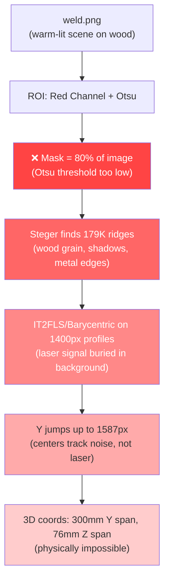

# Root Cause Analysis: weld.png High Inaccuracy

## The Problem

The green line in [visualization.png](file:///c:/Users/ASUS/Documents/Studies&Exams/internship/Project/results/visualization.png) oscillates wildly across the entire image height (±1587 px jumps between consecutive points), failing to track the actual laser stripe. The 3D output spans 300mm in Y and 76mm in Z — physically impossible for a straight horizontal seam.

---

## Root Cause Chain (5 cascading failures)

### ❌ Failure 1: ROI Extraction — Otsu Captures 80% of the Image

> [!CAUTION]
> **The mask covers 79.5% of the image (3.4M of 4.3M pixels)** instead of isolating the thin laser stripe (~2-3% of pixels).

| Metric | Expected | Actual |
|--------|----------|--------|
| Mask coverage | ~2-5% | **79.5%** |
| Stripe width per column | ~10-20 px | **1424 px** |
| Mask height | ~20-40 px | **1792 px (full image)** |
| Active columns | ~2000 | 2390 (every column) |

**Why:** The [ROI extractor](file:///c:/Users/ASUS/Documents/Studies&Exams/internship/Project/preprocessing/roi_extractor.py) uses the **red channel** only, then applies Otsu thresholding. But in `weld.png`:

- The red channel mean is **163.8** (very bright everywhere — this is a well-lit wooden workbench)
- The background red mean is **119.2** vs. stripe red mean **175.3** — only a **1.47× contrast ratio**
- Otsu picks threshold = **146**, which keeps 80% of the image as "foreground"

**The red channel alone cannot separate the laser because the entire scene is warm-toned (wood/metal), so the red channel is uniformly high.**

---

### ❌ Failure 2: Wrong Color Space — Red Channel Is Not Enough

The laser stripe is visible because it's **saturated red** (high R, low G, low B). But the background wood is also reddish-brown (high R, medium G, medium B). Using just `R` channel conflates the two.

What actually distinguishes the laser:
- **Red dominance**: R − max(G, B) > 30 → only **113K pixels** (2.6% of image ✅)
- **HSV red mask**: Hue ∈ [0,10]∪[170,180], S > 50, V > 100 → **154K pixels** (3.6% ✅)

Both of these correctly isolate the thin laser stripe. The single-channel approach does not.

---

### ❌ Failure 3: Steger Detects 179,473 Ridge Points Everywhere

With the mask covering the entire image, Steger's algorithm finds **179,473 ridge points** across the full 2390×1792 image — detecting texture edges in the wood grain, the metal bracket edges, shadows, and the actual laser.

| Metric | Expected | Actual |
|--------|----------|--------|
| Ridge points | ~2000–5000 | **179,473** |
| Coverage | Along laser line only | **Entire image** |

The pipeline then picks "strongest per column" but the wood grain ridges are often stronger than the diffuse laser signal in the red channel alone.

---

### ❌ Failure 4: IT2FLS/Barycentric Operates on Noise Columns

Since each column has a 1400px-tall "stripe mask", the column profiles sent to the extractors contain:
- **Mostly background** (wood texture, metal, shadows)
- **A tiny laser signal** buried in the middle

The profile classifiers categorize 71% of columns as `flat_top` (barycentric) because the wood background creates wide plateaus. The barycentric method then computes centers biased by the background, not the laser.

**Result**: Y coordinates range from **2.1 to 1788.0** (nearly the full image height) with **mean consecutive jumps of 96 pixels**.

---

### ❌ Failure 5: 3D Triangulation Amplifies 2D Noise

The 2D noise (±1587px jumps) propagates through triangulation:
- Y range: **−62 to +237 mm** (300mm span — the seam is probably 200mm wide at most)
- Z range: **154 to 230 mm** (76mm depth variation — should be nearly flat)
- Y std: **51.8mm** (should be < 1mm for a straight seam)

Negative uncertainties (−42.10) in the output indicate that `y_lower > y_upper` in some cases — a clear sign the extraction is giving nonsensical results.

---

## Summary Diagram

## Fix Required

> [!IMPORTANT]
> The ROI extractor must be changed from **red-channel + Otsu** to **red-dominance chromaticity** or **HSV-based** thresholding to correctly isolate the laser stripe on warm-toned scenes.

### Proposed Fix Strategy

1. **ROI Extractor** — Use a **chromaticity-based** laser mask:
   - Compute `red_dominance = R − max(G, B)` (isolates pure red from warm backgrounds)
   - Or use HSV: `(H < 10 or H > 170) and S > 50 and V > 100`
   - Apply morphological closing to connect stripe fragments
   - Keep largest connected component (same as now)

2. **Steger Threshold** — Increase `low_thresh` from `0.05` to something proportional to the actual laser stripe strength (~10-20) to reject wood grain ridges

3. **Profile-based extraction** — Needs the correct narrow mask to work; once the ROI is fixed, the 10-20px-wide stripe profiles will produce correct IT2FLS centers

4. **Sigma tuning** — For this 2390×1792 image with the laser being ~10-15px wide, sigma should be ~3-5 (matching laser half-width), not 1.44

Shall I implement these fixes?
